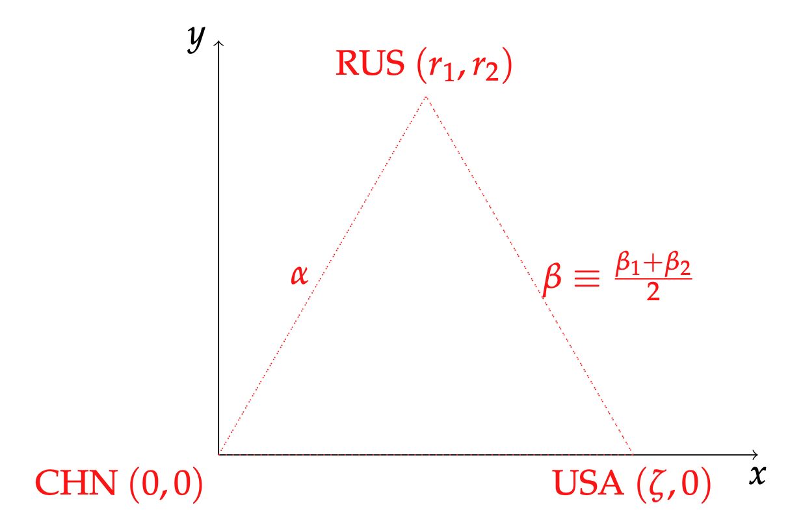

## Conceptual overview  
The goal is to infer countries' distances in a 2D space of political similarity using Gallup disapproval data about the leadership of Russia, China, and the United States from 2006-2024. However, there is a) error in measurement so exact triangulation is not feasible and b) we do not have data from the Chinese population, i.e. we do not have its disapproval of Russia or USA. To account for measurement error and also recover China's distance from other countries, we take the approach behind GPS location detection called 'statistical multilateration', where we treat the Gallup disapproval rates as reports of 'distance' from each of the three relevant anchor countries. We then use those distances to triangulate the country's location in this space. This is complicated by the fact that there is statistical error, and so we adopt probablistic approaches to this problem detailed later. 
### Anchor countries 
In a traditional multilateration problem, one is attempting to find the location of an object like a cell phone; its location is triangulated using its distance from three cell towers. In our case, the three countries' leadership about which there is disapproval data --- USA, Russia, and China--- are the natural choices to be the anchor/reference points (i.e. the cell towers). 
Without loss of generality, we define China's location to be the origin $(0,0)$, and the USA's location to be its disapproval of China, denoted $\zeta$, to be at $(\zeta,0)$. Then, we need to find the coordinates for Russia, where we say that the distance between Russia and the USA is the average of their two disapprovals of each other ($\beta \equiv (\beta_1 + \beta_2)/2$) and its distance from China is denoted $\alpha$. Russia's location is then given by the Pythagorean theorem, where we (WLOG) choose the positive coordinate to get its location: 
{ width=600px }

This technique would work perfectly if there were no error in the reported distances of Russia from China and the US, but indeed there is. This leads to violations of the triangle inequality which make the above technique infeasible in the cases of said inconsistency. As a result, we instead find the 'optimal' coordinate for Russia by finding the point which minimizes the error between the distances implied by the chosen coordinate and the observed distances. To do so requires finding good initial points for the minimization algorithm, as well as a hand-written minimization algorithm; this requires quite a bit of code but is ultimately dedicated only to optimally locating Russia. This is important because the anchor countries are the definitive points in the geometric space against which all other countries are located, and so correctly placing Russia is key.

In addition, we note that Gallup data is missing for the USA's disapproval of Russia in 2008 and of both Russia and China in 2012; we fill in the missing data using Pew data. 

### Other countries
Once the anchor points are defined for each year, we then turn to finding the other countries' locations relative to the anchor countries' coordinates. In this section of the model, there is a large and important point of divergence from how we calculated Russia's location. With Russia, we chose to find the single optimal location of its coordinates (which is necessary for the anchor countries), but for non-anchor countries, we adopt a different approach. Whereas Russia's coordinate is the point that minimizes some log-likelihood, we instead wish to create a representative sample of the other countries' likelihood over the entire feasible space. We then find two countries distances from each other not by computing the Euclidean distance between their optimal coordinates, but instead by measuring the distance between their likelihoods over the entire space. We choose to use $W_2$, the 2-dimensional version of Wasserstein distance, to measure the distance between the likelihoods. However, calculating this distance is computationally expensive, and so we must find a small, representative sample to keep the $W_2$ computation fairly quick. To do this requires the following steps: 

1. Define the posterior distribution 
2. Create a large, very accurate sample of the likelihood 
3. Compress that large sample down to a smaller, representative sample
4. Compute the distance between each country's pairs representative samples 
#### Posterior distribution set-up 
Given the (assumed to be known) location of USA, Russia, and China, all other countries report distances from the anchor countries, where we denote country $i$'s reported distance from anchor country $c \in \mathcal{C}$ in year $t$ as a noisy signal of its true distance:

$\hat{d}_{ict} = d_{ict} + \epsilon_{ict}$

Where we assume that $\epsilon_{ict} \sim \mathcal{N}(0, \sigma^2)$ i.i.d. across countries and years and $d_{ict} = \sqrt{(x_{it} - x_{ct})^2 + (y_{it}-y_{ct})^2}$. Recalling that the pdf of a mean-zero Gaussian is:
$f_{\epsilon}(\hat{d}_{ict} - d_{ict}) = \frac{1}{\sqrt{2\pi \sigma^2}} \exp{-\frac{\epsilon^2}{2\sigma^2}}$
Then the joint probability (given the independence assumption) of observing $\hat{\boldsymbol{d}}_{it}$ given chosen coordinates $(x_{it}, y_{it})$ is: 

$\mathcal{L}(x_{it},y_{it} | \hat{\boldsymbol{d}}_{it}) = \prod_c f_\epsilon(\hat{d}_{ict} - d_{ict}) = \left(\frac{1}{\sqrt{2\pi \sigma^2}}\right)^3 \exp{-\frac{1}{2\sigma^2}\sum\limits_c \left(\hat{d}_{ict} - d_{ict}\right)^2}$

So for each country-year, we will have some $\mathcal{L}_{it}$, and we can normalize it to define 
$g(x,y)_{it} \equiv \frac{\mathcal{L}_{it}}{\int\limits_{\Omega \times \Omega} \mathcal{L}_{it}dxdy}$
Where we choose $\Omega = [-1.5,1.5]$. Note that this is equivalent to a Bayesian posterior if our prior is completely uniform, i.e. $g(x,y)_{it}$ is the posterior distribution of country $i$ in year $t$'s location in the space, assuming a uniform prior. 
#### Getting representative sample of the posterior distribution 
The next goal is to get a representative sample of the posterior distribution so that we can calculate the $W_2$ between two countries' posterior distributions. We get a large sample of $100,000$ points to be a 'master' sample of the posterior, which is achieved via rejection sampling. We then compress this large master sample down to a smaller, discretized sample using [`KMeans`](https://scikit-learn.org/stable/modules/generated/sklearn.cluster.KMeans.html), where we use k-means clustering to find 1000 clusters, and the final sample points are the centers of each of these clusters. Since some clusters could be more or less dense (i.e. contain more or less points from the master sample), we define the marginal distribution (i.e. the weights) over the cluster centers as the number of points in that cluster. This gives a distribution---a set of points and weights---which we can then use to calculate the $W_2$ between countries.[^1] 
#### Calculating distance between posterior distributions
We then calculate the $W_2$ distance between each country pair's posterior distributions using a package from POT (Python Optimal Transport) called [`emd2`](https://pythonot.github.io/all.html#ot.emd2). Note that in order to do calculate the distance involving an anchor country, we must define some posterior despite the fact that we treat them as belonging to a single point. Therefore we choose a posterior with all mass at the relevant coordinate. 

#### Results 
The above process results in a set of $W_2$ distances between all countries' (within each year) posterior distributions of location in a 2D space derived from Gallup leadership disapproval scores. We combine this measure with a distance measure gotten from the Polity Project, which represents countries' political institutions on a scale from -10 to 10 where larger values means more liberal institutions. Normalizing the $W_2$ and polity distances, we then create the final variable representing countries' political distance as a convex combination of the polity and Gallup distances: 

$\overline{d}(d^P_{ijt}, d^G_{ijt}, \alpha) = \alpha d^P_{ijt} + (1-\alpha )d^G_{ijt}$

[^1]: We also tried using [`KBinsDiscretizer`](https://scikit-learn.org/stable/modules/generated/sklearn.preprocessing.KBinsDiscretizer.html)'s quantile binning method to create the discretized sample, but we found that this underperformed in comparison to [`KMeans`](https://scikit-learn.org/stable/modules/generated/sklearn.cluster.KMeans.html). This is because [`KBinsDiscretizer`](https://scikit-learn.org/stable/modules/generated/sklearn.preprocessing.KBinsDiscretizer.html)'s quantile method creates the cut-points along each axis separately, and so the resulting rectangles do not contain the same number of points and also fail to take advantage of the 2D geometry. We found that when comparing the $W_2$ between the master sample and two different samples: one generated via [`KMeans`](https://scikit-learn.org/stable/modules/generated/sklearn.cluster.KMeans.html) and another via [`KBinsDiscretizer`](https://scikit-learn.org/stable/modules/generated/sklearn.preprocessing.KBinsDiscretizer.html), the former produced a lower distance to the master sample. 